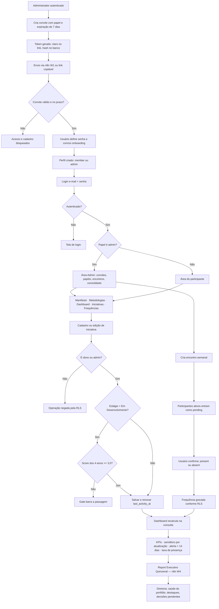

# Fluxograma — Sistema Pulso

```mermaid
flowchart TD
    A[Administrador autenticado] --> B[Cria convite com papel e expiração de 7 dias]
    B --> C[Token gerado: claro no link, hash no banco]
    C --> D[Envio via n8n W1 ou link copiável]
    D --> E{Convite válido e no prazo?}
    E -- Não --> F[Acesso e cadastro bloqueados]
    E -- Sim --> G[Usuário define senha e conclui onboarding]
    G --> H[Perfil criado: member ou admin]
    H --> I[Login e-mail + senha]
    I --> J{Autenticado?}
    J -- Não --> K[Tela de login]
    J -- Sim --> L{Papel é admin?}
    L -- Sim --> M[Área Admin: convites, papéis, encontros, consolidado]
    L -- Não --> N[Área do participante]
    M --> O[Manifesto · Metodologias · Dashboard · Iniciativas · Frequências]
    N --> O

    O --> P[Cadastro ou edição de iniciativa]
    P --> Q{É dono ou admin?}
    Q -- Não --> S[Operação negada pela RLS]
    Q -- Sim --> R{Estágio = Em Desenvolvimento?}
    R -- Sim --> R2{Score dos 4 eixos >= 3,0?}
    R2 -- Não --> S2[Gate barra a passagem]
    R2 -- Sim --> T[Salvar e renovar last_activity_at]
    R -- Não --> T

    M --> U[Cria encontro semanal]
    U --> V[Participantes ativos entram como pending]
    V --> W[Usuário confirma: present ou absent]
    W --> X[Frequência gravada conforme RLS]

    T --> Y[Dashboard recalcula na consulta]
    X --> Y
    Y --> Y2[KPIs · semáforo por atualização · alerta > 14 dias · taxa de presença]
    Y2 --> Z[Report Executivo Quinzenal — n8n W4]
    Z --> Z2[Diretoria: saúde do portfólio, destaques, decisões pendentes]
```
